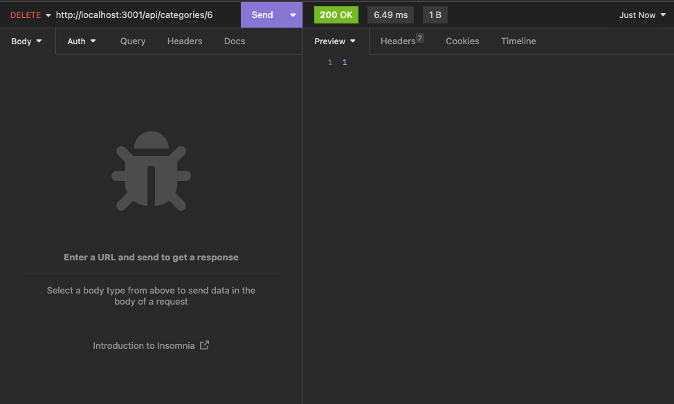

# Challenge 13 - E-Commerce Back End

## Project Description

Expand the functionality of your e-commerce website by implementing a back end API to track your product offerings. This API provides you with a set of endpoints that allow you to retrieve, create, update, and delete entries for different types of data. Additionally, the database that powers this API is already built and ready to go.

This REST API was built on Node.JS, and uses Sequelize to communicate with a MySQL database. A `.env` file must be created to store the database credentials securely. Additionally, I have provided a Collection you can import to Insomnia to test the API endpoints - it's located in the `Insomnia-assets` directory.

Having worked with APIs and relational databases previously made this API easy to implement, but it also helped me understand how APIs are built and how they communicate with a database. All in all, it was very helpful insight.

## Table of Contents
- [User Story](#user-story)
- [Acceptance Criteria](#acceptance-criteria)
- [Links](#links)
- [Dependencies](#dependencies)
- [Usage](#usage)
- [Walkthrough](#walkthrough)
- [Screenshots](#screenshots)

## User Story

```
AS A manager at an internet retail company
I WANT a back end for my e-commerce website that uses the latest technologies
SO THAT my company can compete with other e-commerce companies
```

## Acceptance Criteria

```
GIVEN a functional Express.js API
WHEN I add my database name, MySQL username, and MySQL password to an environment variable file
THEN I am able to connect to a database using Sequelize
WHEN I enter schema and seed commands
THEN a development database is created and is seeded with test data
WHEN I enter the command to invoke the application
THEN my server is started and the Sequelize models are synced to the MySQL database
WHEN I open API GET routes in Insomnia for categories, products, or tags
THEN the data for each of these routes is displayed in a formatted JSON
WHEN I test API POST, PUT, and DELETE routes in Insomnia
THEN I am able to successfully create, update, and delete data in my database
```
 
## Links

To access the code repository, use the link below:

- ### GitHub Repository URL
    https://github.com/sergiorodriguezdev/chl-13-ecommerce-be 

## Dependencies

To install the appropriate dependencies, execute the following command from the repo folder:

```
npm install
```

Alternatively, if the `package.json` file is missing, execute the following commands from the repo folder:

```
npm init -y
npm install dotenv@8.2.0
npm install express@4.17.1
npm install mysql2@2.1.0
npm install sequelize@5.21.7
```

## Usage

1. ### Installing the Dependencies
    Clone or download the repo directory to your local machine and install the dependencies as specified in the [Dependencies](#dependencies) section.

2. ### Creating the database schema

    To create the database schema, you must run the `schema.sql` script which will create the database and the tables. To do so, connect to your MySQL server and run the following command:
    ```
    SOURCE <PATH TO REPO DIRECTORY>/db/schema.sql;
    ```
    Replace `<PATH TO REPO DIRECTORY>` with the actual path to the root directory of the repo.

4. ### Updating database connection information
    Make a copy of the `.env.EXAMPLE` file and name it `.env`. Then, set the following values:
    + `DB_HOST`: This is optional. If you don't provide a value for it then the host value will default to `localhost`
    + `DB_NAME`: Set this to `ecommerce_db`.
    + `DB_USER`: Set this to your MySQL login.
    + `DB_PASSWORD`: Set this to the corresponding password for your MySQL login.

4. ### Seeding the database (OPTIONAL)
    To seed the database, you must first create the database schema (step 2 above), then run the following command from the repo directory:
    ```
    npm run seed
    ```
    Or
    ```
    node seeds/index.js
    ```

5. ### Using the app
    Launch the app by executing the following command:
    ```
    npm start
    ```
    Or
    ```
    node server.js
    ```
    
    The following API endpoints are available:

    **TAGS**
    
    + *GET /api/tags*

        Returns a list of all Tags and their corresponding Products.
    
    + *GET /api/tags/{id}*
    
        Returns a single Tag and its corresponding Products where `{id}` is the Tag ID.

    + *POST /api/tags*

        Creates a new Tag. The Body of the request should look like this:

        ```
        {
	        "tag_name": "New Tag"
        }
        ```
        Required fields: `tag_name`.

    + *PUT /api/tags/{id}*

        Updates an existing Tag where `{id}` is the Tag ID. The Body of the request should look like this:

        ```
        {
	        "tag_name": "New Tag Name"
        }
        ```
        Required fields: `tag_name`.

    + *DELETE /api/tags/{id}*

        Deletes an existing Tag where `{id}` is the Tag ID.

    **PRODUCTS**
    
    + *GET /api/products*

        Returns a list of all Products and their corresponding Category and Tags.
    
    + *GET /api/products/{id}*
    
        Returns a single Product and its corresponding Category and Tags where `{id}` is the Product ID.

    + *POST /api/products*

        Creates a new Product. The Body of the request should look like this:

        ```
        {
            "product_name": "New Product",
            "price": 9.00,
            "stock": 20,
            "category_id": 1
            "tagIds": [1]
        }
        ```
        Required fields: `product_name`, `price`, and `tagIds` which is an array of Tag IDs.

        If `stock` is not provided, it defaults to `10`. `category_id` is the ID of the Category the Product belongs to, it not provided then it's set to `null`.

    + *PUT /api/products/{id}*

        Updates an existing Product where `{id}` is the Product ID. The Body of the request should look like this:

        ```
        {
            "product_name": "New Product Name",
            "price": 9.00,
            "stock": 20,
            "tagIds": [1]
        }
        ```
        Required fields: `product_name`, `price`, `stock`, or `tagIds` which is an array of Tag IDs.

    + *DELETE /api/products/{id}*

        Deletes an existing Product where `{id}` is the Product ID.

    **CATEGORIES**
    
    + *GET /api/categories*

        Returns a list of all Categories and their corresponding Products.
    
    + *GET /api/categories/{id}*
    
        Returns a single Category and its corresponding Products where `{id}` is the Category ID.

    + *POST /api/categories*

        Creates a new Category. The Body of the request should look like this:

        ```
        {
	        "category_name": "New Category"
        }
        ```
        Required fields: `category_name`.

    + *PUT /api/categories/{id}*

        Updates an existing Category where `{id}` is the Category ID. The Body of the request should look like this:

        ```
        {
	        "category_name": "New Category Name"
        }
        ```
        Required fields: `category_name`.

    + *DELETE /api/categories/{id}*

        Deletes an existing Category where `{id}` is the Category ID.

## Walkthrough

Click [HERE](https://github.com/sergiorodriguezdev/chl-13-ecommerce-be/assets/119548442/2e5834d8-e3f3-44ee-a9e8-ad28f8240da8) for a walkthrough of the app.

## Screenshots

### Database Schema and Seeds


### Usage




